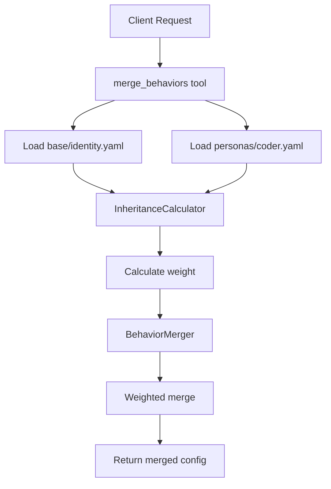

# Helios MCP Server Architecture

## Overview

Helios is a configuration management system for AI behaviors using weighted inheritance. It gives AI agents persistent personalities through a hierarchical configuration system where specialized personas inherit from a base identity.

**Core Formula**: `inheritance_weight = base_importance / (specialization_level ** 2)`

## File Structure

### Project Layout
```
helios-mcp/
├── src/
│   └── helios_mcp/
│       ├── __init__.py
│       ├── server.py          # FastMCP server entry point
│       ├── config/
│       │   ├── __init__.py
│       │   ├── loader.py      # YAML configuration loading
│       │   └── models.py      # Pydantic models for configs
│       ├── inheritance/
│       │   ├── __init__.py
│       │   ├── calculator.py  # Inheritance weight calculations
│       │   └── merger.py      # Behavior merging logic
│       ├── persistence/
│       │   ├── __init__.py
│       │   └── git_store.py   # Git operations for versioning
│       └── tools/
│           ├── __init__.py
│           └── behaviors.py   # MCP tool implementations
├── tests/
└── pyproject.toml
```

### User Configuration Directory
```
~/.helios/
├── base/
│   └── identity.yaml          # Core configuration
├── personas/
│   └── coder.yaml            # Phase 1: Single persona
├── learned/                  # Future: learned patterns
├── temporary/                 # Future: temp overrides
└── .git/                     # Version control
```

## Core Classes and Responsibilities

### 1. ConfigLoader (`config/loader.py`)
**Responsibility**: Load and parse YAML configurations from filesystem

```python
class ConfigLoader:
    def __init__(self, base_path: Path = Path.home() / ".helios"):
        self.base_path = base_path
    
    async def load_base(self) -> BaseConfig:
        """Load base configuration from base/identity.yaml"""
        
    async def load_persona(self, name: str) -> PersonaConfig:
        """Load specific persona configuration"""
        
    async def ensure_structure(self):
        """Create directory structure if not exists"""
```

### 2. InheritanceCalculator (`inheritance/calculator.py`)
**Responsibility**: Calculate inheritance weights based on specialization levels

```python
class InheritanceCalculator:
    @staticmethod
    def calculate_weight(base_importance: float, specialization_level: int) -> float:
        """
        Core inheritance formula:
        inheritance_weight = base_importance / (specialization_level ** 2)
        
        Args:
            base_importance: 0.0 to 1.0 - how much base matters
            specialization_level: 1+ - how specialized the persona is
        
        Returns:
            Weight for base configuration (0.0 to 1.0)
        """
        return base_importance / (specialization_level ** 2)
```

### 3. BehaviorMerger (`inheritance/merger.py`)
**Responsibility**: Merge base and persona configurations using calculated weights

```python
class BehaviorMerger:
    def __init__(self, calculator: InheritanceCalculator):
        self.calculator = calculator
    
    async def merge(
        self, 
        base: BaseConfig, 
        persona: PersonaConfig
    ) -> MergedBehavior:
        """
        Merge base and persona behaviors using weighted inheritance
        
        Formula: merged = base * weight + persona * (1 - weight)
        """
```

### 4. GitStore (`persistence/git_store.py`)
**Responsibility**: Persist configuration changes via git commits

```python
class GitStore:
    def __init__(self, repo_path: Path):
        self.repo_path = repo_path
        
    async def commit_change(
        self, 
        file_path: Path, 
        message: str, 
        content: str
    ):
        """Commit configuration change to git"""
        
    async def ensure_repo(self):
        """Initialize git repo if not exists"""
```

### 5. HeliosServer (`server.py`)
**Responsibility**: FastMCP server with tool decorators

```python
from fastmcp import FastMCP
from fastmcp.types import Context

mcp = FastMCP("helios-mcp")

@mcp.tool
async def get_base_config(ctx: Context) -> dict:
    """Retrieve base configuration"""
    loader = ConfigLoader()
    base = await loader.load_base()
    return base.model_dump()

@mcp.tool
async def get_active_persona(ctx: Context, name: str = "coder") -> dict:
    """Get currently active persona configuration"""
    loader = ConfigLoader()
    persona = await loader.load_persona(name)
    return persona.model_dump()

@mcp.tool
async def merge_behaviors(
    ctx: Context,
    persona_name: str = "coder"
) -> dict:
    """Calculate and return merged behavior configuration"""
    loader = ConfigLoader()
    base = await loader.load_base()
    persona = await loader.load_persona(persona_name)
    
    merger = BehaviorMerger(InheritanceCalculator())
    merged = await merger.merge(base, persona)
    return merged.model_dump()

@mcp.tool
async def commit_changes(
    ctx: Context,
    config_type: str,
    content: dict,
    message: str
) -> str:
    """Persist configuration changes via git"""
    store = GitStore(Path.home() / ".helios")
    # Convert dict to YAML and save
    await store.commit_change(...)
    return f"Committed: {message}"
```

## Data Models (`config/models.py`)

```python
from pydantic import BaseModel, Field
from typing import Dict, List, Optional

class BaseConfig(BaseModel):
    """Core identity configuration"""
    identity: str
    values: List[str]
    communication_style: str
    base_importance: float = Field(default=0.7, ge=0.0, le=1.0)
    behaviors: Dict[str, str]

class PersonaConfig(BaseModel):
    """Specialized persona configuration"""
    name: str
    specialization_level: int = Field(default=1, ge=1)
    focus_areas: List[str]
    behaviors: Dict[str, str]
    overrides: Optional[Dict[str, str]] = None

class MergedBehavior(BaseModel):
    """Result of merging base and persona"""
    active_persona: str
    inheritance_weight: float
    merged_behaviors: Dict[str, str]
    base_contribution: float
    persona_contribution: float
```

## Data Flow for Inheritance Calculations

### Phase 1: Single Persona Flow



### Inheritance Calculation Process

1. **Load Configurations**
   - Base config from `~/.helios/base/identity.yaml`
   - Persona config from `~/.helios/personas/{name}.yaml`

2. **Calculate Weight**
   ```python
   weight = base_importance / (specialization_level ** 2)
   # Example: 0.7 / (2 ** 2) = 0.175
   ```

3. **Merge Behaviors**
   ```python
   for key in all_behavior_keys:
       if key in base and key in persona:
           merged[key] = interpolate(base[key], persona[key], weight)
       elif key in persona.overrides:
           merged[key] = persona.overrides[key]  # Full override
       elif key in base:
           merged[key] = base[key] * weight  # Inherited with decay
   ```

4. **Persist Changes**
   - Any modifications trigger git commit
   - Atomic commits for each change
   - Clear commit messages for evolution tracking

## Tool Definitions

### Phase 1 Tools (Ship TODAY)

| Tool | Purpose | Input | Output |
|------|---------|-------|--------|
| `get_base_config` | Retrieve base configuration | None | BaseConfig dict |
| `get_active_persona` | Get persona configuration | name: str | PersonaConfig dict |
| `merge_behaviors` | Calculate merged behavior | persona_name: str | MergedBehavior dict |
| `commit_changes` | Save configuration changes | config_type, content, message | Commit confirmation |

### Example Tool Usage

```python
# Client requests merged behavior
result = await merge_behaviors(persona_name="coder")

# Result structure:
{
    "active_persona": "coder",
    "inheritance_weight": 0.175,  # 0.7 / (2^2)
    "merged_behaviors": {
        "communication_style": "technical_precise",  # 82.5% from persona
        "code_review_approach": "thorough",         # 100% from persona
        "documentation_style": "concise"            # 17.5% from base
    },
    "base_contribution": 0.175,
    "persona_contribution": 0.825
}
```

## Example Configurations

### Base Configuration (`~/.helios/base/identity.yaml`)
```yaml
identity: "Helpful AI Assistant"
values:
  - clarity
  - efficiency
  - continuous learning
communication_style: "professional and friendly"
base_importance: 0.7
behaviors:
  greeting: "Hello! How can I help you today?"
  problem_solving: "Let me break this down step by step"
  uncertainty: "I'm not certain, but here's what I think"
```

### Persona Configuration (`~/.helios/personas/coder.yaml`)
```yaml
name: "coder"
specialization_level: 2
focus_areas:
  - software development
  - debugging
  - code review
behaviors:
  greeting: "Ready to code! What are we building?"
  problem_solving: "Let's trace through the code logic"
  code_review_approach: "Check for bugs, performance, and readability"
overrides:
  language_preference: "Python with type hints"
```

## Git Persistence Strategy

### Commit Structure
- Each configuration change = one atomic commit
- Commit message format: `[{type}] {action}: {description}`
- Types: `base`, `persona`, `learned`, `temp`
- Actions: `create`, `update`, `merge`, `delete`

### Example Git History
```
[persona] update: Adjust coder specialization level to 3
[base] update: Increase base_importance to 0.8
[learned] create: Add pattern for error handling preference
[persona] merge: Combine coder and researcher behaviors
```

## Phase 1 Implementation Checklist

- [ ] Create directory structure at `~/.helios/`
- [ ] Implement ConfigLoader for YAML loading
- [ ] Implement InheritanceCalculator with core formula
- [ ] Implement BehaviorMerger for weighted merging
- [ ] Create GitStore for persistence
- [ ] Build FastMCP server with 4 tools
- [ ] Add example base and coder persona configs
- [ ] Test end-to-end flow
- [ ] Package with UV and publish to PyPI

## Success Criteria

1. **Minimal Working System**: ONE persona loads and merges with base
2. **Correct Inheritance**: Weight calculation follows formula exactly
3. **Git Persistence**: Every change creates a commit
4. **Tool Interface**: All 4 tools accessible via MCP
5. **Deployable**: `uv tool install helios-mcp` works

## Future Phases (After Phase 1 Ships)

- **Phase 2**: Multiple personas, dynamic switching
- **Phase 3**: Learning system (repetition → pattern → permanence)
- **Phase 4**: Temporary overrides with expiration
- **Phase 5**: Cross-persona combinations for complex tasks

## Key Design Decisions

1. **YAML over JSON**: Human-readable, comment-friendly
2. **Git-native**: Every change is versioned, portable via git
3. **Weighted inheritance**: Mathematical model for behavior blending
4. **Local-first**: No external dependencies, pure filesystem
5. **FastMCP decorators**: Simple, Pythonic tool definitions